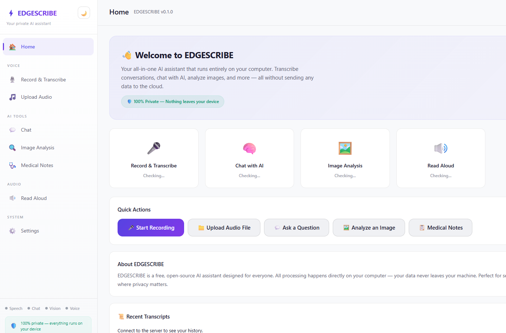

# EDGESCRIBE

**On-device AI for speech, vision, and language. Private. Open source.**

<p align="center">
  
  <br>
  <em>Built-in web UI — chat, transcribe, OCR, and speak — all running locally on your device.</em>
</p>

EDGESCRIBE is a fully open-source, on-device AI assistant for medical transcription, document OCR, and clinical note generation. Speech-to-text, image understanding, LLM chat, and text-to-speech — all local, all private, zero cloud dependencies.

## ✨ Key Features

| Feature | Description |
|---------|-------------|
| 🎤 **Real-time ASR** | Live microphone → text, streaming output |
| 🧠 **LLM Chat** | SOAP notes, summarization, terminology correction |
| 🖼️ **Vision & OCR** | Analyze images, extract text from prescriptions and documents |
| 🔊 **Text-to-Speech** | Natural voice readback with Kokoro |
| 🌐 **Web UI + REST API** | Built-in frontend at `localhost:8080`, REST API for integration |
| 🔒 **100% Private** | Zero network calls during use. HIPAA-friendly by design |
| ⚡ **GPU Accelerated** | Vulkan (NVIDIA/AMD/Intel) + Metal (macOS). Auto-fallback to CPU |
| 📦 **Tiny Footprint** | ~2 MB binary + ~80 MB runtime DLLs. Models downloaded separately |
| 🔧 **Ollama-style CLI** | `pull` / `run` / `chat` / `serve` — familiar workflow |

## Architecture

```
edgescribe.exe (single C++ binary)
├── llama.cpp          → LLM + Vision (Qwen3-VL, GGUF, GPU via Vulkan/Metal)
├── onnxruntime-genai  → ASR (Nemotron Parakeet 0.6B, ONNX)
├── onnxruntime        → TTS (Kokoro 82M, ONNX, espeak-ng phonemizer)
├── httplib.h          → REST API server + Web UI
└── miniaudio.h        → Cross-platform audio capture/playback
```

### Inference Stack

| Engine | Model | Format | Runtime | GPU | Size |
|--------|-------|--------|---------|-----|------|
| ASR | Parakeet TDT 0.6B | ONNX | onnxruntime-genai | CPU (lazy-loaded) | ~670 MB |
| LLM | Qwen3-VL-2B Q4_K_M | GGUF | llama.cpp | Auto GPU (mmap) | ~1.0 GB |
| Vision | Qwen3-VL mmproj | GGUF | llama.cpp + mtmd | CPU (auto VRAM check) | ~781 MB |
| TTS | Kokoro 82M | ONNX | onnxruntime | CPU (lazy-loaded) | ~330 MB |

### Memory Management

- **LLM/Vision**: Loaded via `mmap` — near-zero idle RAM, OS manages pages automatically
- **ASR/TTS**: Lazy-loaded on first request, auto-unloaded after 5 min idle
- **KV Cache**: Prefix caching across multi-turn chat — only new tokens processed

See [doc/RAM-memory-management.md](doc/RAM-memory-management.md) for details.

---

## Quick Start

### 1. Download

Grab the latest release from [Releases](https://github.com/rui-ren/EdgeScribe/releases):

| Platform | Download | GPU |
|----------|----------|-----|
| Windows x64 | `openscribe-win-x64.zip` | Vulkan (auto-fallback to CPU) |
| macOS Apple Silicon | `openscribe-osx-arm64.tar.gz` | Metal |

Windows users: run `vc_redist_x64.exe` (included) if you get DLL errors.

### 2. Download Models

```bash
edgescribe pull nemotron    # ASR — speech-to-text (~670 MB)
edgescribe pull qwen3-vl    # LLM + Vision — chat, OCR, SOAP (~1.8 GB)
edgescribe pull kokoro      # TTS — text-to-speech (~330 MB)
```

All models download from public HuggingFace repos — no account or token needed.

### 3. Use

```bash
# Start the web UI + REST API
edgescribe serve

# Or use CLI directly
edgescribe run --live                    # Live transcription
edgescribe chat "What is hypertension?"  # LLM chat
edgescribe vision rx.jpg --ocr           # OCR a prescription
edgescribe speak "Patient is stable."    # Text-to-speech
edgescribe process --soap transcript.txt # Generate SOAP notes
```

Open `http://localhost:8080` in your browser for the web UI.

---

## Commands

### Model Management

| Command | Description |
|---------|-------------|
| `edgescribe pull <model>` | Download a model from HuggingFace |
| `edgescribe pull <model> --token <hf_token>` | Download gated/private model with auth |
| `edgescribe list` | List available and downloaded models |
| `edgescribe remove <model>` | Delete a downloaded model |

### Speech-to-Text (ASR)

| Command | Description |
|---------|-------------|
| `edgescribe run --live` | Live microphone transcription |
| `edgescribe run <file.wav>` | Transcribe a WAV file |
| `edgescribe run <file> -o out.txt` | Transcribe and save to file |
| `edgescribe devices` | List audio input devices |

```bash
# Live transcription — speaks into mic, text streams to terminal
edgescribe run --live

# Live transcription with a specific model path
edgescribe run --live --model /path/to/custom/model

# Transcribe a WAV file
edgescribe run meeting.wav

# Transcribe and save output
edgescribe run meeting.wav -o transcript.txt

# Use a specific model
edgescribe run meeting.wav --model nemotron
```

### Vision & OCR

| Command | Description |
|---------|-------------|
| `edgescribe vision <image>` | Describe an image |
| `edgescribe vision <image> --prompt "..."` | Analyze with custom prompt |
| `edgescribe vision <image> --ocr` | Extract text from image (OCR) |
| `edgescribe vision <image> -o out.txt` | Save analysis to file |

```bash
# Describe an image
edgescribe vision photo.jpg

# OCR — extract text from a document photo
edgescribe vision prescription.jpg --ocr

# Analyze with a specific prompt
edgescribe vision xray.jpg --prompt "Describe any abnormalities"

# Save output to file
edgescribe vision chart.jpg --ocr -o extracted.txt

# Use a specific model
edgescribe vision scan.png --model /path/to/qwen3-vl
```

### LLM Chat

| Command | Description |
|---------|-------------|
| `edgescribe chat` | Interactive multi-turn chat (type `/exit` to quit) |
| `edgescribe chat "<prompt>"` | Single-turn chat with the local language model |
| `edgescribe chat "<prompt>" -o out.txt` | Save response to file |

```bash
# Interactive multi-turn chat (remembers conversation context)
edgescribe chat
# You: What are the side effects of metformin?
# Assistant: Common side effects include nausea, diarrhea...
# You: What about for patients with kidney disease?
# Assistant: For patients with renal impairment, metformin...
# You: /exit

# Single-turn question
edgescribe chat "What are the side effects of metformin?"

# Save response
edgescribe chat "Summarize diabetes treatment guidelines" -o summary.txt

# Save full conversation from interactive mode
edgescribe chat -o conversation.txt
```

### Post-Processing

| Command | Description |
|---------|-------------|
| `edgescribe process --soap <file>` | Generate SOAP notes from transcript |
| `edgescribe process --summarize <file>` | Summarize text |
| `edgescribe process --fix-terms <file>` | Fix medical terminology errors |
| `edgescribe process --soap <file> --image ` | SOAP notes with image context |

```bash
# Generate SOAP notes from a transcript
edgescribe process --soap transcript.txt

# Generate SOAP notes with an attached image
edgescribe process --soap transcript.txt --image xray.jpg

# Summarize a document
edgescribe process --summarize meeting_notes.txt

# Fix medical terminology in a transcript
edgescribe process --fix-terms raw_transcript.txt

# Save output
edgescribe process --soap transcript.txt -o soap_notes.txt
```

### Text-to-Speech

| Command | Description |
|---------|-------------|
| `edgescribe speak "<text>"` | Read text aloud through speakers |
| `edgescribe speak <file.txt>` | Read a text file aloud |
| `edgescribe speak "<text>" -o out.wav` | Save speech to WAV file |
| `edgescribe speak --voices` | List available voices |

```bash
# Speak text aloud
edgescribe speak "The patient presents with acute bronchitis."

# Read a file aloud
edgescribe speak soap_notes.txt

# Save to WAV file
edgescribe speak "Hello world" -o greeting.wav

# Use a specific voice and speed
edgescribe speak "Hello" --voice af_heart --speed 1.2

# List available voices
edgescribe speak --voices
```

## Global Options

| Option | Short | Description | Default |
|--------|-------|-------------|---------|
| `--model <name\|path>` | `-m` | Model to use | `nemotron` (ASR), `qwen3-vl` (vision/chat), `kokoro` (TTS) |
| `-o <file>` | `--output` | Write output to file | stdout |
| `--prompt <text>` | `-p` | Custom prompt (vision) | "Describe this image in detail." |
| `--voice <name>` | `-v` | TTS voice name | `af_heart` |
| `--speed <float>` | | TTS speaking speed | `1.0` |
| `--ocr` | | OCR mode (vision) | off |
| `--soap` | | SOAP notes mode (process) | — |
| `--summarize` | | Summarize mode (process) | — |
| `--fix-terms` | | Fix medical terms mode (process) | — |
| `--image <file>` | | Attach image to process (SOAP) | — |
| `--live` | | Live microphone mode (run) | — |
| `--voices` | | List TTS voices (speak) | — |
| `--version` | `-v` | Show version | — |
| `--help` | `-h` | Show help | — |

## Models

| Model | Type | Size | Format | HuggingFace Repo |
|-------|------|------|--------|-----------------|
| `nemotron` | ASR | ~670 MB | ONNX | jiafatom/nemotron-cpu-int4 |
| `qwen3-vl` | LLM+Vision | ~1.8 GB | GGUF (Q4_K_M + mmproj) | Qwen/Qwen3-VL-2B-Instruct-GGUF |
| `kokoro` | TTS | ~330 MB | ONNX (FP32) | onnx-community/Kokoro-82M-ONNX |
| | | **~2.8 GB** | | **Total for full AI suite** |

Available TTS voices: `af` (default female), `af_bella`, `af_sky`, `am_adam`

Models are downloaded from public HuggingFace repos — no account needed.
For gated/private models: `edgescribe pull <model> --token hf_xxxxx`

### Model Cache

| Platform | Path | Override |
|----------|------|---------|
| Windows | `%LOCALAPPDATA%\EDGESCRIBE\models\` | `EDGESCRIBE_MODEL_DIR` |
| macOS/Linux | `~/.EDGESCRIBE/models/` | `EDGESCRIBE_MODEL_DIR` |

### Using a Custom Model

You can point to any local model directory (for ONNX models) or GGUF file (for LLM/Vision):

```bash
edgescribe run --live --model /path/to/my/custom/model
edgescribe chat "Hello" --model /path/to/model.gguf
```

## Building from Source

### Prerequisites

- CMake 3.18+
- C++20 compiler (MSVC 2022, Clang 14+, GCC 12+)
- onnxruntime-genai headers and libraries (for ASR + TTS)
- llama.cpp headers and libraries (for LLM + Vision)

See [doc/llama-cpp-integration.md](doc/llama-cpp-integration.md) for detailed setup.

### Build

```bash
# Clone
git clone https://github.com/EDGESCRIBE/EDGESCRIBE.git
cd EDGESCRIBE

# Download miniaudio (single-header audio library)
mkdir -p include
curl -sL -o include/miniaudio.h https://raw.githubusercontent.com/mackron/miniaudio/master/miniaudio.h

# Configure and build
cmake -B build -DCMAKE_BUILD_TYPE=Release \
  -DORT_GENAI_PATH=/path/to/onnxruntime-genai \
  -DLLAMA_CPP_PATH=/path/to/llama.cpp/install
cmake --build build --config Release
```

### Build with local onnxruntime-genai source

If you've built onnxruntime-genai from source:

```bash
cmake -B build -DCMAKE_BUILD_TYPE=Release \
  -DORT_GENAI_PATH=/path/to/onnxruntime-genai/build/Windows/Release \
  -DLLAMA_CPP_PATH=/path/to/llama.cpp/install
```

The `ORT_GENAI_PATH` should contain:
- `include/` with `ort_genai.h` and `ort_genai_c.h`
- `lib/` with the native libraries (`.dll` / `.dylib` / `.so`)

The `LLAMA_CPP_PATH` should contain:
- `include/` with `llama.h`
- `lib/` with the llama library

## REST API Server

Start the API server to integrate with any frontend:

```bash
# Start on default port 8080
edgescribe serve

# Custom port
edgescribe serve --port 3000

# Specify which models to load
edgescribe serve --asr-model /path/to/nemotron --vlm-model /path/to/qwen3-vl
```

### API Endpoints

**Health & Info:**

| Method | Endpoint | Description |
|--------|----------|-------------|
| GET | `/v1/health` | Health check + loaded engines |
| GET | `/v1/models` | List loaded models |

**Speech-to-Text:**

| Method | Endpoint | Description |
|--------|----------|-------------|
| POST | `/v1/transcribe/file` | Upload WAV file, get transcript |
| POST | `/v1/transcribe/stream` | Start streaming ASR session |
| POST | `/v1/transcribe/push` | Push raw PCM audio chunk |
| POST | `/v1/transcribe/flush` | Flush and get final transcript |

**LLM Chat:**

| Method | Endpoint | Description |
|--------|----------|-------------|
| POST | `/v1/chat` | Chat completion |
| POST | `/v1/chat/soap` | Generate SOAP notes from transcript |
| POST | `/v1/chat/summarize` | Summarize text |

**Vision:**

| Method | Endpoint | Description |
|--------|----------|-------------|
| POST | `/v1/vision/analyze` | Analyze image with prompt (multipart) |
| POST | `/v1/vision/ocr` | OCR an image (multipart) |

**Text-to-Speech:**

| Method | Endpoint | Description |
|--------|----------|-------------|
| POST | `/v1/tts/synthesize` | Text → WAV audio |
| GET | `/v1/tts/voices` | List available voices |

### API Examples

```bash
# Health check
curl http://localhost:8080/v1/health

# Transcribe a file
curl -X POST http://localhost:8080/v1/transcribe/file \
  -F "audio=@meeting.wav"

# Chat
curl -X POST http://localhost:8080/v1/chat \
  -H "Content-Type: application/json" \
  -d '{"prompt": "What are the side effects of ibuprofen?", "system": "You are a medical assistant."}'

# SOAP notes
curl -X POST http://localhost:8080/v1/chat/soap \
  -H "Content-Type: application/json" \
  -d '{"transcript": "Patient presents with headache for 3 days..."}'

# Vision / OCR
curl -X POST http://localhost:8080/v1/vision/ocr \
  -F "image=@prescription.jpg"

# Text-to-speech (returns WAV)
curl -X POST http://localhost:8080/v1/tts/synthesize \
  -H "Content-Type: application/json" \
  -d '{"text": "Hello world", "voice": "af_heart"}' \
  -o output.wav

# List TTS voices
curl http://localhost:8080/v1/tts/voices
```

### Frontend Integration

The API server binds to `127.0.0.1` (localhost only) and includes CORS headers, so any local web frontend can connect:

```javascript
// JavaScript example
const res = await fetch('http://localhost:8080/v1/chat', {
  method: 'POST',
  headers: { 'Content-Type': 'application/json' },
  body: JSON.stringify({ prompt: 'Hello', system: 'You are helpful.' })
});
const data = await res.json();
console.log(data.text);
```

## Architecture

```
EDGESCRIBE (C++, MIT)
├── llama.cpp             # Inference engine for LLM + Vision (MIT)
├── onnxruntime-genai     # Inference engine for ASR (MIT)
├── onnxruntime           # Inference engine for TTS (MIT)
├── miniaudio.h           # Cross-platform audio capture + playback (Public Domain)
├── GGUF models           # LLM/Vision from HuggingFace (open weights)
└── ONNX models           # ASR/TTS from HuggingFace (open weights)
```

```
src/
├── cli/main.cpp                # CLI entry point — all commands
├── core/model_manager.h/cpp    # HuggingFace model download + cache
├── asr/                        # Speech-to-Text (Nemotron)
│   ├── transcriber.h/cpp       ── StreamingProcessor + Generator pipeline
│   ├── audio_capture.h/cpp     ── Microphone input (miniaudio)
│   └── audio_file.h/cpp        ── WAV file loader
├── llm/                        # Language Model (Qwen3-VL text mode, llama.cpp)
│   └── llm_engine.h/cpp        ── Chat, SOAP notes, summarize, fix terms
├── vision/                     # Vision + OCR (Qwen3-VL vision mode, llama.cpp)
│   └── vision_engine.h/cpp     ── CLIP + llama.cpp, OCR, image analysis
└── tts/                        # Text-to-Speech (Kokoro ONNX)
    └── tts_engine.h/cpp        ── ONNX Runtime C++ API, audio playback
```

### Data Flow

```
🎤 ASR:    Mic/WAV → StreamingProcessor → Generator → TokenizerStream → text  (onnxruntime-genai)
🧠 LLM:    Prompt → llama_tokenize → llama_decode → llama_sampler → text     (llama.cpp)
🖼️ Vision: Image+Prompt → CLIP encoder → llama_decode → text                  (llama.cpp)
🔊 TTS:    Text → Phonemizer → ONNX Runtime Session → PCM audio → speaker    (onnxruntime)
```

## Privacy & Security

- **On-device processing** — Audio never leaves your machine
- **No telemetry** — Zero analytics, zero tracking
- **No cloud dependency** — Works fully offline after model download
- **HIPAA-friendly** — No PHI transmitted, no BAA needed
- **Open source** — Full source code available for audit

## Roadmap

### v1.0 — Core AI Suite ✅ (Current)

- [x] CLI tool with `pull` / `run` / `list` / `remove` commands
- [x] Live microphone transcription
- [x] WAV file transcription
- [x] Cross-platform builds (Windows x64, macOS ARM64)
- [x] LLM chat (`edgescribe chat`) with multi-turn support
- [x] Vision & OCR (`edgescribe vision`)
- [x] SOAP notes / summarize / fix terms (`edgescribe process`)
- [x] Text-to-speech (`edgescribe speak`) with espeak-ng phonemizer
- [x] Windows installer (Inno Setup, auto-adds to PATH)
- [x] Local REST API server (`edgescribe serve`) + built-in Web UI
- [x] GPU acceleration — Vulkan (NVIDIA/AMD/Intel) + Metal (macOS), auto-detect with CPU fallback
- [x] KV cache reuse for multi-turn chat (prefix matching, only new tokens processed)
- [x] Smart memory management — mmap for LLM, lazy load/unload for ASR/TTS
- [x] Auto GPU/CPU layer splitting (llama.cpp handles VRAM overflow)
- [x] VRAM-aware mmproj loading (auto CPU fallback for small GPUs)
- [x] SQLite persistent memory — auto-save chat + process history
- [x] HuggingFace token support for gated/private model downloads
- [x] Performance stats (TTFT, tok/s, cache hits)

### v1.1 — Quality + Polish

- [ ] Speaker diarization (who said what)
- [ ] Word-level timestamps
- [ ] SRT/VTT subtitle export
- [ ] Streaming SSE for chat API (real-time token streaming to frontend)
- [ ] Multiple ASR languages

### v1.2 — Knowledge Base (RAG)

- [ ] Document ingestion with text chunking (TXT, CSV, MD)
- [ ] FTS5 search on knowledge base chunks
- [ ] RAG-augmented LLM prompts (auto-retrieve relevant context)
- [ ] `edgescribe kb` CLI commands (add, list, search, remove)
- [ ] REST API endpoints for KB (`/v1/kb/*`)

### v1.3 — Fine-Tuned Models + SaaS

- [ ] Specialty LoRA adapters (cardiology, dermatology, orthopedics)
- [ ] Fine-tuned SOAP model (distilled from GPT-4 quality data)
- [ ] Embedding model for semantic search (`all-MiniLM-L6-v2`)
- [ ] Cloud SaaS tier with agent workflows

### Future

- [ ] CUDA-specific optimized build
- [ ] PDF/DOCX ingestion for knowledge base
- [ ] Mobile deployment (iOS/Android)
- [ ] Package managers (winget, brew, apt)
- [ ] Configurable context window (`--context 8192`)
- [ ] NVIDIA Jetson / Raspberry Pi deployment

## Documentation

| Document | Description |
|----------|-------------|
| [llama-cpp-integration.md](doc/llama-cpp-integration.md) | Build guide, CMake, GPU backends, model management |
| [RAM-memory-management.md](doc/RAM-memory-management.md) | mmap, lazy loading, idle unloading, memory budgets |
| [deployment.md](doc/deployment.md) | Platform deployment, Jetson, Docker, systemd |
| [kv-cache-optimization.md](doc/kv-cache-optimization.md) | KV cache prefix matching for multi-turn chat |
| [ort-llama-cpp.md](doc/ort-llama-cpp.md) | ONNX Runtime vs llama.cpp comparison |
| [GTM.md](doc/GTM.md) | Go-to-market strategy |
| [demo.md](doc/demo.md) | 5-minute demo script |

## License

MIT — see [LICENSE](LICENSE).

## Acknowledgments

- [llama.cpp](https://github.com/ggerganov/llama.cpp) — LLM and Vision inference (GGUF, Vulkan/Metal)
- [ONNX Runtime GenAI](https://github.com/microsoft/onnxruntime-genai) — ASR inference
- [ONNX Runtime](https://github.com/microsoft/onnxruntime) — TTS inference
- [cpp-httplib](https://github.com/yhirose/cpp-httplib) — HTTP server
- [miniaudio](https://github.com/mackron/miniaudio) — Cross-platform audio
- [espeak-ng](https://github.com/espeak-ng/espeak-ng) — Text-to-phoneme conversion
- [NVIDIA Parakeet](https://huggingface.co/nvidia/parakeet-tdt-0.6b-v2) — ASR model
- [Qwen3-VL](https://huggingface.co/Qwen/Qwen3-VL-2B-Instruct) — Vision + language model
- [Kokoro TTS](https://github.com/thewh1teagle/kokoro-onnx) — Text-to-speech model
